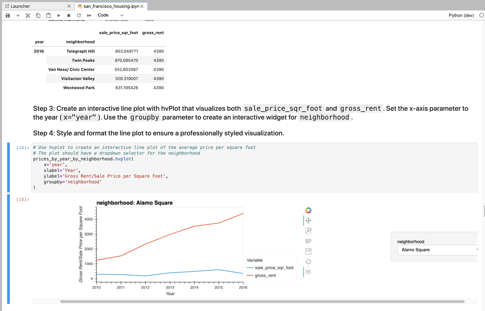
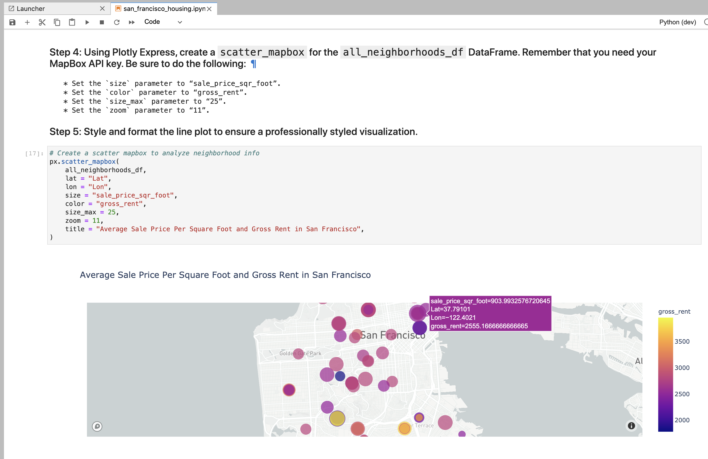

# Module_6_Challenge

This is the repository for my module 6 challenge. In this module challenge, we did an analysis of the San Francisco housing market to better understand changes in property price as well as changes in property rental price. The ultimate goal of this challenge was to find areas in the San Francisco market that would be viable investment opportunities.

We used plotly express, hvplot, and the Mapbox API to visualize our analysis. With Mapbox API, we're able to generate a map of San Francisco to display visualizations.

#### Note for viewer - Due to the file size, you are unable to see the san_francisco_housing.ipynb file in the Github viewer. In order to see it you have to download the file and run the notebook.

---

## Technologies

Import the following at the beginning of your jupyter notebook:

```python
import os
import pandas as pd
import plotly.express as px
import hvplot.pandas
from pathlib import Path
from dotenv import load_dotenv

%matplotlib inline
```

---

## Example

This image shows how an ineractive plot was generated that displays sales price per square foot and average gross rent in SF from 2010-2016.


The following image shows a plot that allows you to dig deeper on price and rent changes and select a specific neighboorhood in SF.



This final image displays the visualization that we were able to generate through Mapbox API. The different colored circles represent different rent costs for different neighboorhoods.



---

## Contributors

UCB Fintech Bootcamp, Wynham Guillemot 

---

## License

MIT License

Copyright (c) [2021] [UCB Fintech Bootcamp, Wyham Guillemot]

Permission is hereby granted, free of charge, to any person obtaining a copy
of this software and associated documentation files (the "Software"), to deal
in the Software without restriction, including without limitation the rights
to use, copy, modify, merge, publish, distribute, sublicense, and/or sell
copies of the Software, and to permit persons to whom the Software is
furnished to do so, subject to the following conditions:

The above copyright notice and this permission notice shall be included in all
copies or substantial portions of the Software.

THE SOFTWARE IS PROVIDED "AS IS", WITHOUT WARRANTY OF ANY KIND, EXPRESS OR
IMPLIED, INCLUDING BUT NOT LIMITED TO THE WARRANTIES OF MERCHANTABILITY,
FITNESS FOR A PARTICULAR PURPOSE AND NONINFRINGEMENT. IN NO EVENT SHALL THE
AUTHORS OR COPYRIGHT HOLDERS BE LIABLE FOR ANY CLAIM, DAMAGES OR OTHER
LIABILITY, WHETHER IN AN ACTION OF CONTRACT, TORT OR OTHERWISE, ARISING FROM,
OUT OF OR IN CONNECTION WITH THE SOFTWARE OR THE USE OR OTHER DEALINGS IN THE
SOFTWARE.
